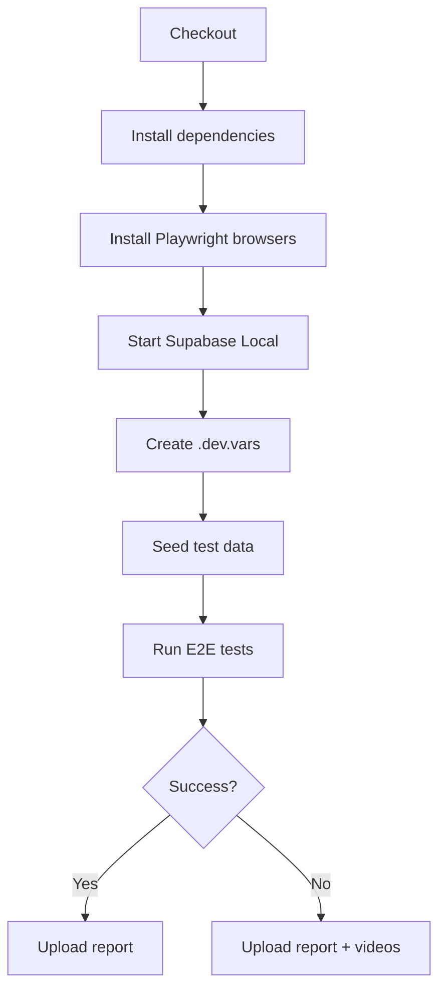

# CI/CD ワークフロー

## 概要

GitHub Actionsを使用したCI/CDパイプライン。

## ワークフロー

### ci.yml

PRとmainブランチへのプッシュ時に実行される。

#### ジョブ構成

| ジョブ | トリガー | 内容 |
|--------|----------|------|
| `lint-and-typecheck` | PR, push | ESLint + TypeScript型チェック |
| `e2e` | PR, push | Playwright E2Eテスト |

#### E2Eテストの実行フロー



| ステップ | 内容 |
|----------|------|
| Install dependencies | Node.js 20 + pnpm 9 |
| Install Playwright | chromiumブラウザのみ（高速化） |
| Start Supabase | 不要サービス除外で高速起動 |
| Create .dev.vars | `supabase status`から認証情報取得 |
| Seed test data | シードキャラクター・ダンジョン投入 |
| Run E2E tests | `pnpm dev`でweb+api起動後テスト実行 |

## ローカルでのCI再現

```bash
# Supabase起動
supabase start

# シードデータ投入
pnpm --filter @ai-trpg/api seed

# E2Eテスト実行
pnpm --filter @ai-trpg/web e2e
```

## 必要なシークレット

現在、シークレット設定は不要（Supabase Localを使用）。

本番デプロイを追加する場合は以下が必要：
- `CLOUDFLARE_API_TOKEN` - Cloudflare Workers デプロイ用
- `SUPABASE_ACCESS_TOKEN` - Supabase プロジェクト操作用

## トラブルシューティング

### E2Eテストがタイムアウトする

- Supabaseの起動に時間がかかる場合がある
- `webServer.timeout`を増やす（現在120秒）

### シードデータが投入されない

- `DATABASE_URL`が正しいか確認
- Supabaseが起動しているか確認（`supabase status`）

### Playwrightがブラウザを見つけられない

- `playwright install --with-deps chromium`を実行
